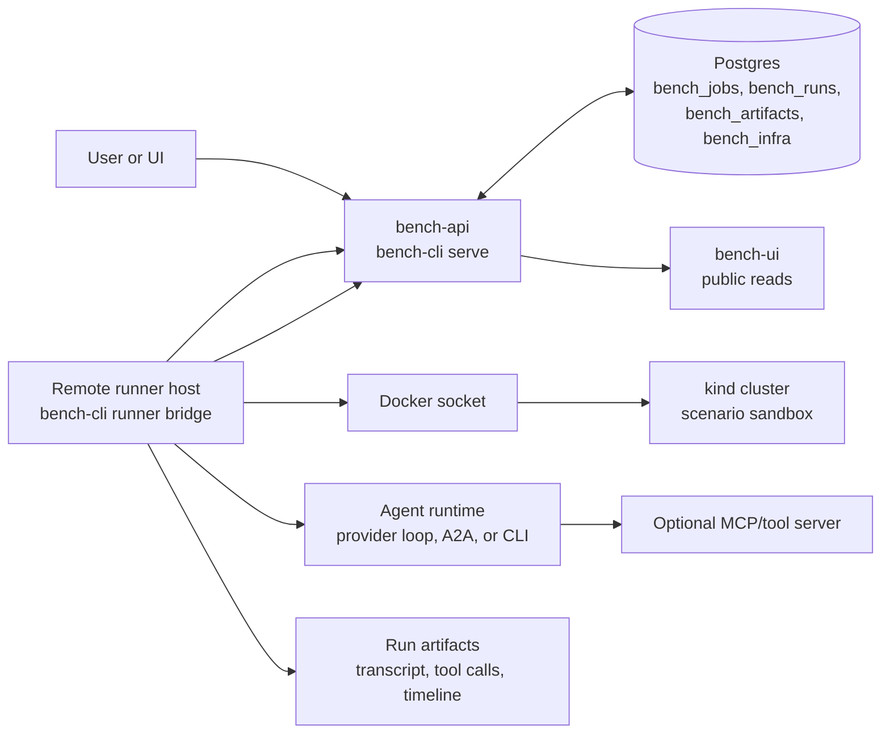
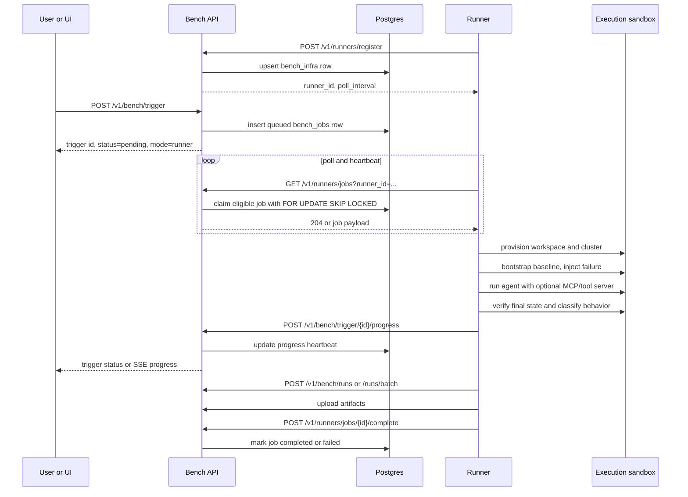

# Bench Runner Architecture

Bench runners execute benchmark jobs outside the hosted control plane. The
control plane owns API auth, trigger state, queued jobs, public reads, and
result storage. A runner owns the infrastructure sandbox, agent process, tool
server process, artifacts, and final run delivery.

The runner protocol is poll-based. Runners need outbound HTTPS access to the
Bench API, but the Bench service does not need inbound access to the runner
host. This keeps self-hosted runners usable behind NAT, firewalls, and customer
networks.

## Deployment Shape

The Docker image in this repo is the Bench runtime image. In hosted
deployments, `bench-api` usually runs with `BENCH_CONTROL_PLANE_ONLY=true`, so
it does not create local kind clusters. Remote runners create their own
clusters or attach to a configured execution environment.

The runner image uses the host Docker socket to create kind clusters as sibling
containers. It is not Docker-in-Docker.

## Job Lifecycle

## Responsibilities

| Component | Owns |
|---|---|
| Bench API | bearer auth, tenant mapping, job queue, public reads, result ingestion, artifacts, analytics |
| Postgres | durable runners, jobs, runs, artifacts, scenario catalog, model metadata |
| Runner | polling, heartbeat, scenario execution, sandbox lifecycle, agent/tool-server startup, artifact collection |
| Agent adapter | how the tested agent receives a task and acts: provider loop, A2A, CLI, or MCP-backed tool calls |
| Verifier | final infrastructure checks and behavior classification |

## Control-Plane-Only Mode

`BENCH_CONTROL_PLANE_ONLY=true` or `bench-cli serve --control-plane-only`
starts the API without a local direct executor. In this mode:

- `/v1/bench/*` public and authenticated routes stay available
- `/v1/runners/*` registration, polling, and completion stay available
- `POST /v1/bench/trigger` queues work only when a healthy runner is eligible
- `POST /v1/certify` returns `501 Not Implemented`

Use this for hosted deployments where execution happens on external runner
hosts.

## Queue Semantics

Runners register model capabilities and optional provider metadata. When a
trigger arrives, the control plane looks for a healthy runner that advertises
the requested model. If the request includes `runner_id`, only that runner may
claim the job.

Polling also refreshes runner heartbeat state. Job claiming uses
`FOR UPDATE SKIP LOCKED`, so multiple runners can poll concurrently without
claiming the same job. Claimed jobs store the owning runner in
`bench_jobs.infra_id`.

The runner janitor marks silent runners unhealthy and re-queues stale claimed
jobs whose `last_progress_at` or `started_at` exceeded the stale threshold.

## Tool Server Runs

Tool-server comparisons are modeled through stable labels, not special runtime
modes:

- empty `tool_server`: baseline or direct provider-loop run
- non-empty `tool_server`: run used the named external tool server
- `tool_server_version`: exact version tested for reports and comparisons

The runner receives `mcp_server` as the executable command to start and
`tool_server` / `tool_server_version` as report identity metadata.

## Contracts

- [Runner Control Plane Contract](contracts/BENCH_RUNNER_CONTROL_PLANE_V1.md)
- [Bench API Reference](BENCH_API_REFERENCE.md)
- [Executor Contract](contracts/EXECUTOR_CONTRACT_V1.md)
- [Bench Service Setup](guides/bench-service-setup.md)
