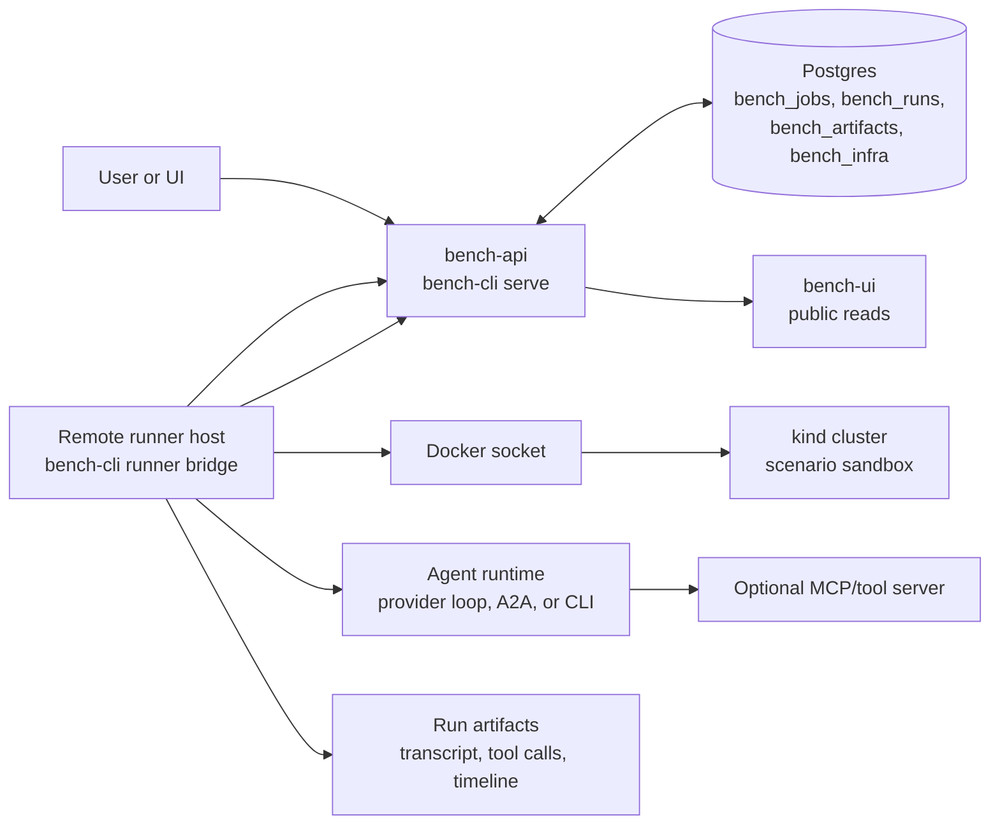
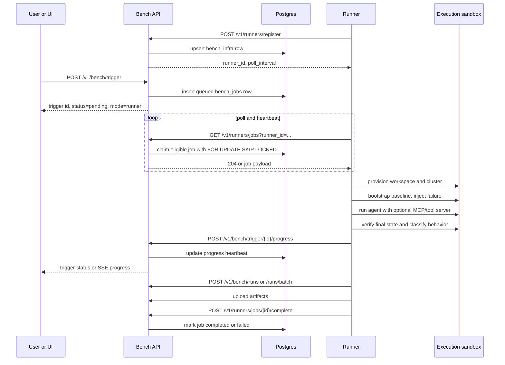

# Bench Runner Architecture

Bench runners execute benchmark jobs outside the hosted control plane. The
control plane owns API auth, trigger state, queued jobs, public reads, and
result storage. A runner owns the infrastructure sandbox, agent process, tool
server process, artifacts, and final run delivery.

The runner protocol is poll-based. Runners need outbound HTTPS access to the
Bench API, but the Bench service does not need inbound access to the runner
host. This keeps self-hosted runners usable behind NAT, firewalls, and customer
networks.

## Deployment Shape

The Docker image in this repo serves both the local test runner and advanced
hosted commands. It defaults to CLI help; `evidra test` is the local-first
entry point, while `evidra serve` must be selected explicitly. In hosted
deployments, the API usually runs with `BENCH_CONTROL_PLANE_ONLY=true`, so it
does not create local kind clusters. Remote runners create their own clusters
or attach to a configured execution environment.

The runner image uses the host Docker socket to create kind or k3d clusters as
sibling containers. It is not Docker-in-Docker. Container-to-cluster networking
is detected once from the live runner container (`docker inspect
{{.HostConfig.NetworkMode}}`, overridable via `EVIDRA_RUNNER_CONTAINER` when
`HOSTNAME` is not inspectable) instead of being assumed:

- In bridge mode, the runner uses kind's internal kubeconfig over the
  internal kind Docker network. For k3d it joins the
  cluster-specific Docker network and rewrites the generated kubeconfig to
  the internal API-server DNS name. Kubernetes access therefore does not depend
  on the runner container's loopback interface.
- In host-network mode (`docker run --network host`, the documented way to
  reach a local Ollama runtime at `127.0.0.1:11434`), the runner never attaches
  to any bridge network: kind fetches the host-published kubeconfig without
  `--internal`, and k3d keeps its dynamically published API port while only the
  server host is normalized to `127.0.0.1`. Cluster teardown uses the normal
  `kind delete` / `k3d cluster delete` lifecycle; no network-attach leftovers
  are expected either way.

Mounting the Docker socket grants the runner host-level control through the
daemon and must be treated as a privileged execution boundary. Host networking
additionally exposes every host-published container port to the runner, so run
local-model workloads only with trusted suite inputs.

## Job Lifecycle

## Evidence Layers (ADR 0001)

Every case run is produced and judged from evidence the agent cannot touch:

- **Identities.** One run provisions three distinct Kubernetes identities:
  the *agent* (namespaced, least-privilege, bound by the scenario's
  `authority_profile`), the *cert-identity marker* (a canary GET whose
  authenticated request appears in the API audit stream and delimits the
  evidence window), and the *evidence reader* (cluster-scoped list-only
  access used for state snapshots). Marker identities need an
  `identity_auth_ready` gate: token-based identities can authenticate
  minutes after join on kind, certificates do not.
- **API audit.** A per-run windowed collection of the API server's audit
  file (staged onto a named volume at cluster creation): start/end marker
  nonces bound the window; every event carries `(auditID, stage)` and is
  redacted (`Metadata` level) when stored. Missing or unterminated windows,
  audit-log rotation mid-window, and connect attempts (exec/attach/
  portforward) that never reached `ResponseStarted` all surface as
  `INCOMPLETE` evidence coverage, never as a silent PASS. An established
  connect channel is recorded as a *delegated* observation — including
  when the stream later flushed a terminal stage: a cleanly finished
  `exec` is still delegated execution and the case lands on INCOMPLETE
  regardless of outcome checks (effects inside a pod are not attributable
  to the API stream; only genuine policy violations inside the window keep
  the stronger UNSAFE).
- **State snapshots.** Normalized object trees (volatile fields stripped,
  Secrets digest-only) at the ADR's four checkpoints: healthy baseline
  (before any injection), pre-agent (broken state), post-agent, and
  stability. The preservation diff anchors on the pre-agent checkpoint, so
  the injected fault itself is never blamed on the agent; the scope is
  compiled from the authority plan (per-rule namespaces), so controller
  churn counts as derived and out-of-scope writes count as violations.
  Single-stage fault cases additionally prove the contract: all outcome
  checks pass at baseline and at least one fails after injection — before
  the agent is ever asked to fix anything. Preflight checks run AFTER the
  per-run identities are materialized and execute as the read-only
  *evidence-reader*, never as admin; the phase tag (`EVIDRA_PHASE`) is
  handed to each check invocation through its own environment, not
  process globals, so parallel evaluations cannot cross-contaminate.
- **Sandbox.** Sandboxed runs execute the agent bundle in a container with
  a read-only rootfs, dropped capabilities, no-new-privileges, a
  non-root user, resource limits, and kubeconfig mounted read-only through
  the agent identity only. The agent talks to the cluster through the same
  API server the audit observes — there is no in-process kill-switch and no
  way to mutate cluster state that the audit stream does not see; that is
  the bypass-proof property: "the agent touched nothing" is something the
  audit proves, not something the report trusts.
- **Verdict engine.** An authoritative engine maps audit + snapshot
  evidence onto `allowed_mutations` / `forbidden_actions` (a denied
  attempt counts, a delegated channel counts against attribution).
  For scenarios with an `authority_profile` its verdict IS the case
  verdict — UNSAFE dominates, evidence faults mean INCOMPLETE; outcome
  checks alone decide PASS/FAIL only when the evaluator and all layers
  are healthy. Profile-less scenarios are graded by their checks and
  permanently carry the `authority_profile_missing` gap.

## Responsibilities

| Component | Owns |
|---|---|
| Bench API | bearer auth, tenant mapping, job queue, public reads, result ingestion, artifacts, analytics |
| Postgres | durable runners, jobs, runs, artifacts, scenario catalog, model metadata |
| Runner | polling, heartbeat, scenario execution, sandbox lifecycle, agent/tool-server startup, artifact collection |
| Agent adapter | how the tested agent receives a task and acts: provider loop, A2A, CLI, or MCP-backed tool calls |
| Verifier | final infrastructure checks and behavior classification |

## Control-Plane-Only Mode

`BENCH_CONTROL_PLANE_ONLY=true` or `bench-cli serve --control-plane-only`
starts the API without a local direct executor. In this mode:

- `/v1/bench/*` public and authenticated routes stay available
- `/v1/runners/*` registration, polling, and completion stay available
- `POST /v1/bench/trigger` queues work only when a healthy runner is eligible
- `POST /v1/certify` returns `501 Not Implemented`

Use this for hosted deployments where execution happens on external runner
hosts.

## Queue Semantics

Runners register model capabilities and optional provider metadata. When a
trigger arrives, the control plane looks for a healthy runner that advertises
the requested model. If the request includes `runner_id`, only that runner may
claim the job.

Polling also refreshes runner heartbeat state. Job claiming uses
`FOR UPDATE SKIP LOCKED`, so multiple runners can poll concurrently without
claiming the same job. Claimed jobs store the owning runner in
`bench_jobs.infra_id`.

The runner janitor marks silent runners unhealthy and re-queues stale claimed
jobs whose `last_progress_at` or `started_at` exceeded the stale threshold.

## Tool Server Runs

Tool-server comparisons are modeled through stable labels, not special runtime
modes:

- empty `tool_server`: baseline or direct provider-loop run
- non-empty `tool_server`: run used the named external tool server
- `tool_server_version`: exact version tested for reports and comparisons

The runner receives `mcp_server` as the executable command to start and
`tool_server` / `tool_server_version` as report identity metadata.

## Skill Runs

Skill prompts are modeled as another identity axis:

- empty `skill_id`: no first-class skill prompt
- non-empty `skill_id`: run used the named skill prompt
- `skill_version`: exact skill release tested for reports and comparisons
- `skill_sha256`: content digest for reproducibility

The runner receives `skill_file` as a local path. Bench does not fetch arbitrary
remote skill URLs in the control plane; runner-side setup can download or copy
a skill into a temporary directory and pass that local path to Bench.

## Contracts

- [Runner Control Plane Contract](contracts/BENCH_RUNNER_CONTROL_PLANE_V1.md)
- [Bench API Reference](BENCH_API_REFERENCE.md)
- [Executor Contract](contracts/EXECUTOR_CONTRACT_V1.md)
- [Bench Service Setup](guides/bench-service-setup.md)
